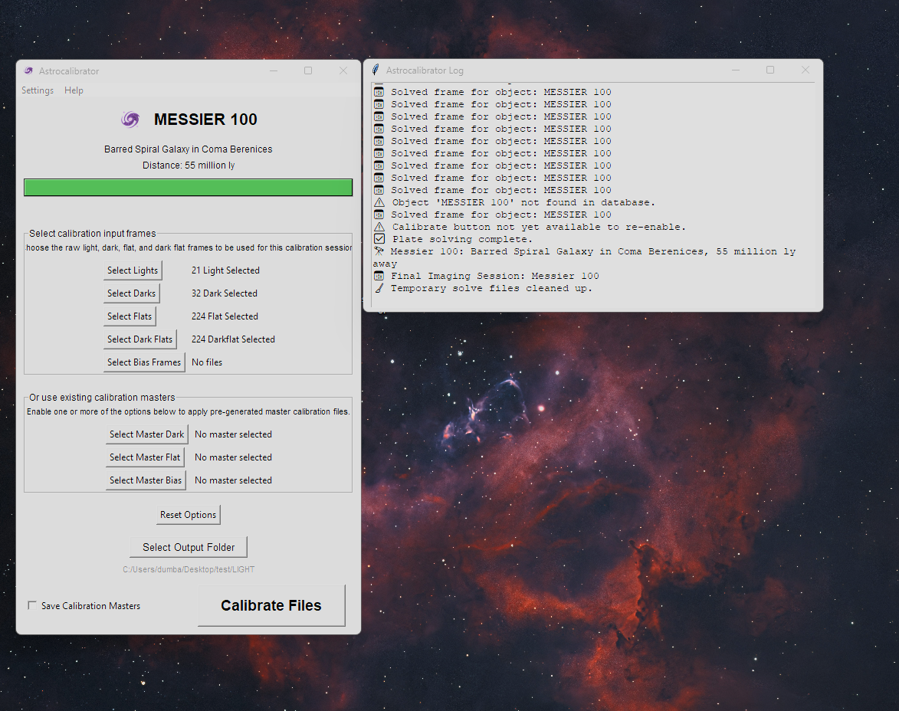

# Astrocalibrator



Astrocalibrator is a lightweight and user-friendly calibration tool designed for astrophotography workflows. It provides an easy way to calibrate light frames using dark, flat, dark flat, and bias frames — or master calibration files.
It is especially useful for archiving calibrated data for later processes in multi session imaging!

## Features

- 📂 Load and manage Light, Dark, Flat, Dark Flat, and Bias images
- 📦 Support for using existing Master Dark, Flat, and Bias calibration files
- 📦 Create new Master Dark, Flat, and Bias calibration files
- 🚀 Automatic **plate solving** of light frames using ASTAP
- 🌌 Auto-update and preserve FITS headers after solving
- 🔄 Full calibration pipeline: bias/dark subtraction, flat correction
- 📋 Log window with pop-out/dock support
- 🛠 Settings menu for ASTAP location configuration
- 🧹 Reset button to clear all selections quickly
- 🖼️ Simple About window with drag support
- 🪐 Easy manual calibration start with "Calibrate Lights" button
- 💾 Output calibrated frames to a chosen directory

## Requirements

- Python 3.9+
- Modules: `tkinter`, `astropy`, `Pillow`, `astroquery`
- ASTAP installed (for plate solving)

## Installation

1. Install required Python modules:

```bash
pip install pillow astropy astroquery scipy
```

2. Install ASTAP:

- Download ASTAP from: https://www.hnsky.org/astap.htm
- Set the ASTAP executable location inside Astrocalibrator settings.

## How to Run

Clone or download the project, then:

```bash
python main.py
```

A standalone Windows installer (`.exe`) is also available under [Releases](https://github.com/yourproject/releases) if you prefer not to use Python.

## License

This project is open-source under the MIT License.

## Author

Created by Kelsi Davis
Website: [geekastro.dev](https://geekastro.dev)

---

Enjoy effortless astrophotography calibration! 🌟

